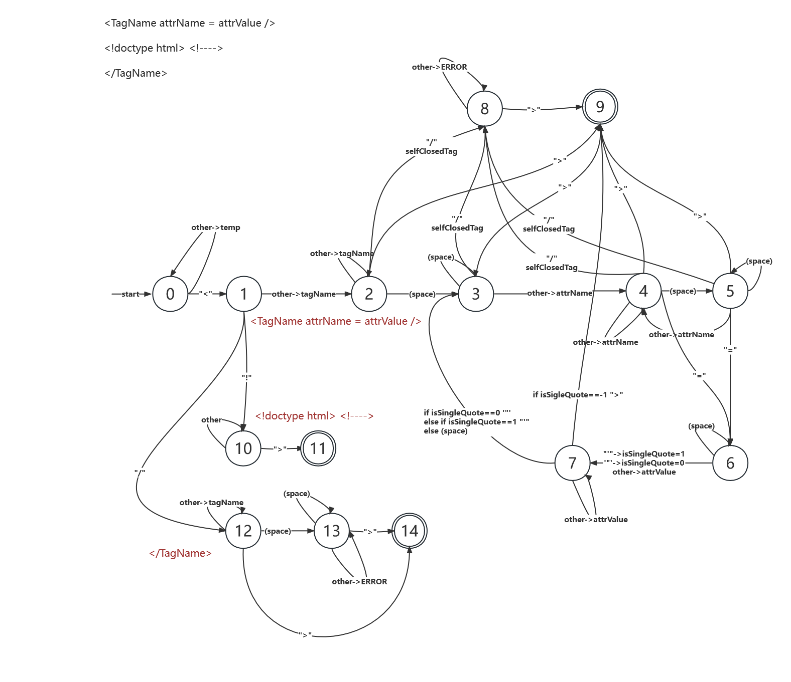
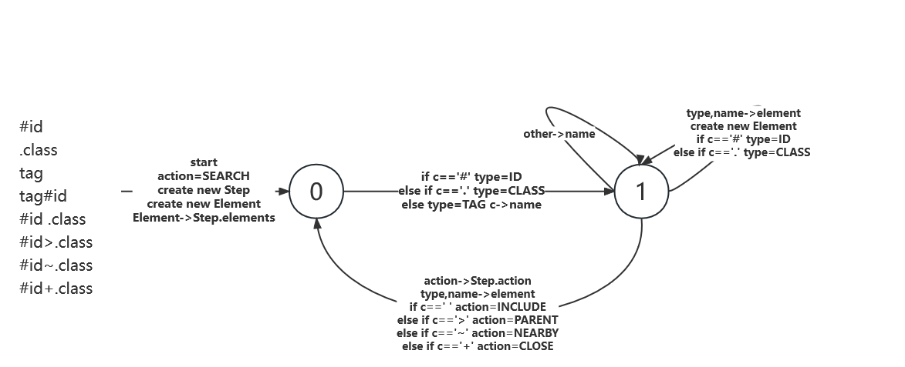

# HTML PARSER

基于 C++的 HTML 文档解析，支持 CSS 选择器查询元素

## 支持的 CSS 选择器

1. 元素选择器：`div`,`body`
2. id 选择器：`#id`
3. 类选择器：`.cls`
4. 后代选择器：`ul li`
5. 直接子代选择器：`ul>li`
6. 兄弟选择器：`li~li`
7. 相邻兄弟选择器：`li+li`

以上选择器可组合使用  
例如：`div#test.test ul>li~li~li`，查询 id 和 class 都为`test`的`div`标签，并且查询其后代标签`ul`，之后查询其直接后代`li`的之后的兄弟元素`li`，再查询其之后的兄弟元素`li`

# 用法

引入`element.h`，`parse.h`

```c++
HTMLParser p;
p.create(chrstr);
std::vector<DOMElement *> d = p.documentSelectorAll("div");
if (d.size() == 0) {
    std::cout  << "NOT FOUND" << std::endl;
} else {
    for (auto i = d.begin(); i != d.end(); ++i) {
        std::cout << (*i)->getInnerHTML() << std::endl;
    }
}
```

## HTMLParser

```c++
// 初始化HTMLParser类
HTMLParser::HTMLParser()

// 解析html文档
// src：待解析文档字符串
// strictMode：是否为严格模式，在严格模式下，若文档解析出现错误则立刻停止解析（如标签未闭合，多余字符等），默认值为false
// 返回值：是否解析成功
bool HTMLParser::create(const char* str, bool strictMode=false)

// 从根开始查询元素
// query：CSS选择器语句
// 返回值：匹配到的第一个元素，若没有返回nullptr
DOMElement *HTMLParser::documentSelector(const char *query)

// 从根开始查询全部元素
// query：CSS选择器语句
// 返回值：匹配到的全部元素，若没有返回一个size=0的vector
vector<DOMElement *> HTMLParser::documentSelectorAll(const char *query)
```

## DOMElement

```c++
// 查询元素
// query：CSS选择器语句
// 返回值：匹配到的第一个元素，若没有返回nullptr
DOMElement *HTMLParser::documentSelector(const char *query)

// 查询全部元素
// query：CSS选择器语句
// 返回值：匹配到的全部元素，若没有返回一个size=0的vector
vector<DOMElement *> HTMLParser::documentSelectorAll(const char *query)

// 获取当前标签内文本
// 返回值：标签内文本
const char *getInnerHTML()

// 获取标签属性
// key：属性名称
// 返回值：若有此属性，返回属性值，否则返回nullptr
const char *getAttribute(const char *key)

// 获取标签名称
// 返回值：标签名称
const char *getTagName()
```

# 原理

## 标签解析状态机

需要解析三种标签：
1. `<TagName attrName = attrValue />`
2. `<!doctype html> <!---->`
3. `</TagName>`



状态9，将标签进行压栈，同时将标签加入栈顶标签的直接子代列表内；同时记录当前位置  
状态11，不对注释和文档说明标签进行处理，直接抛弃  
状态14，判断栈顶元素是否与当前闭合标签一致，不一致抛出错误或自动闭合；根据栈顶元素记录的初始位置与当前位置，计算innerHTML  

特殊情况1：在状态9时，若标签为script，则下一个标签必须为/script，否则不做标签处理  

## 查询语句：CSS选择器 状态机
将查询分为两个属性：
1. action: 步骤类型  
   - SEARCH/INCLUDE: 从当前元素开始，使用BFS查找操作元素
   - PARENT：查找当前元素的直接子元素
   - NEARBY：从当前元素的父元素开始，首先找到当前元素位置，之后再查找目标元素
   - CLOSE：从当前元素的父元素开始，首先找到当前元素位置，再判断下一个元素是否为目标元素
2. element：操作元素，vector，包含标签，class，id三种类型多个对象


